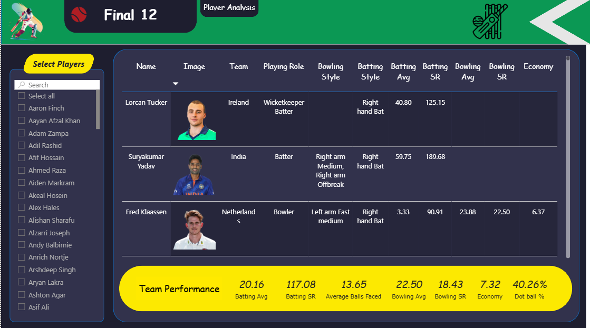

# 🏏 T20 Cricket Data Analysis Dashboard

### 📌 Problem Statement

This project aims to analyze extensive T20 cricket match data to identify the best-performing players across various playing roles (Openers, Anchors, Finishers, All-rounders, and Bowlers). The primary objective is to assemble a statistically strong "Final 11" team capable of winning matches by evaluating:

* **Player Consistency:** Identifying top-performing players based on batting and bowling averages.
* **Match Impact:** Analyzing strike rates and economy rates to determine match-winners.
* **Role Suitability:** Selecting the best fit for specific batting positions and bowling spells.
* **Venue & Toss Trends:** Understanding how external factors influence match outcomes (win patterns, toss impact).

---

### 📂 Dataset Information

The analysis is built on **4 primary CSV datasets** containing comprehensive information on T20 matches:

* **Match Summary:** High-level match details (Team 1 vs Team 2, Winner, Margin, Ground, Match Date).
* **Batting Summary:** Ball-by-ball or innings-level data (Runs, Balls Faced, 4s, 6s, Out/Not Out).
* **Bowling Summary:** Bowling figures (Overs, Maidens, Runs Conceded, Wickets, Economy).
* **Player Information:** Player roles, batting styles, and bowling styles.

> **Source:** Data sourced from online cricket databases (e.g., ESPNCricinfo / Kaggle) covering recent T20 World Cup or International formats.

---

### 🛠 Tools Used

* **Microsoft Power BI:** For building the interactive dashboard and visualizations.
* **Power Query:** For data cleaning, transformation, and creating the star schema data model.
* **DAX (Data Analysis Expressions):** For creating complex measures like "Strike Rate", "Winning %", and "Boundary %".

---

### 📊 Key KPIs

The dashboard tracks vital performance metrics to evaluate players:

* **Batting:** Total Runs, Batting Average, Strike Rate (SR), Boundary %, Average Balls Faced.
* **Bowling:** Wickets, Economy Rate, Bowling Strike Rate, Bowling Average, Dot Ball %.
* **Team Selection:** Combined Team Batting Average vs. Bowling Economy.

---

### 💡 Key Insights

* **Anchors vs. Power Hitters:** The dashboard clearly differentiates players who stabilize the innings (Anchors like Virat Kohli) versus those who accelerate scoring (Finishers/Openers).
* **Economy is Key:** In the "All-Rounders" analysis, players with lower Economy rates combined with high Batting Strike Rates are identified as the most valuable assets.
* **Performance Outliers:** Scatter plots reveal players who significantly outperform the average (e.g., Suryakumar Yadav's high strike rate combined with a high average).
* **Final 11 Selection:** The "Final 12" view aggregates the selected players to show a hypothetical team performance summary, ensuring the team covers all bases (batting depth + bowling options).

---

### 📷 Dashboard Preview

**1. Openers Analysis**
*Evaluates powerplay performance, focusing on strike rate and boundary percentage.*

  

**2. Anchors Analysis**
*Identifies stable batters who can play long innings with a solid average.*

  

**3. All-Rounders Analysis**
*Comparison of batting and bowling capabilities to find versatile players.*

  

**4. Bowlers Analysis**
*Deep dive into bowling economy, wickets taken, and dot ball percentage.*

  

**5. Final 11 Selection**
*The ultimate team selected based on the data analysis, showing aggregate team strength.*

  

---

### 🚀 How to Use

1. **Download the Repository:** Clone or download the project files to your local machine.
2. **Maintain Structure:** Ensure the `.pbix` file and the `data/` folder (containing the CSVs) are kept in the same relative paths to avoid data connection errors.
3. **Open in Power BI:** Open the `.pbix` file using **Microsoft Power BI Desktop**.
4. **Refresh Data:** If you have updated CSV files, click the **"Refresh"** button in the Home tab to update the dashboard visuals.
